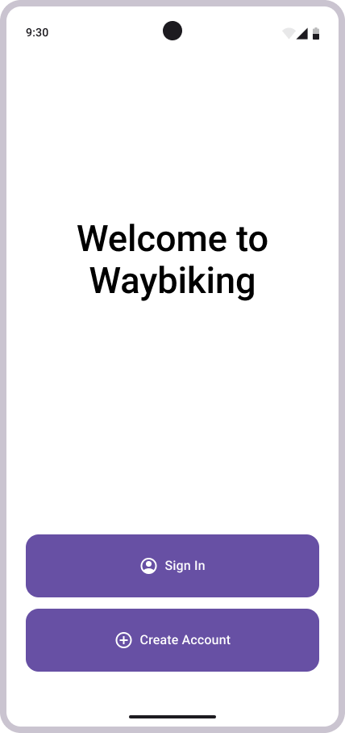

# Conception

## Architecture

- Décrire l'architecture du système proposé.

## Choix technologiques

- L'application sera construite sur Android Studio

## Modèles et diagrammes

- Diagramme de classes

- Diagramme entité-relations

## Prototype

- Premier écran

- Créer profile

- Se connecter

- Accueil

- Notter

- Enregistrer un trajet

- Identifier un lieu

- Liste de trajets

- Visualiser un trajet

- Paramètres utilisateur

